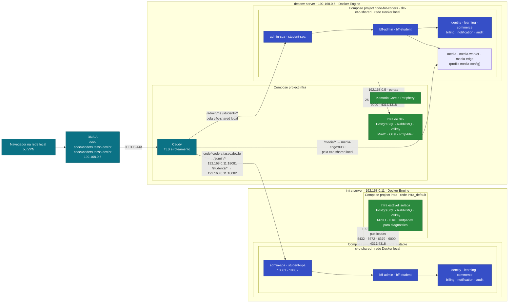

# Topologia de rede e containers

## Visão geral

## Como o tráfego passa

- Os dois registros DNS A apontam atualmente para `192.168.0.5`, endereço privado do `desenv-server`.
- O Caddy termina TLS e atende os dois domínios. A raiz redireciona para `/admin/`; as rotas sem barra final recebem redirecionamento para a versão com barra.
- No domínio `dev-code4coders.tasso.dev.br`, o Caddy acessa as SPAs diretamente pela rede Docker `c4c-shared` do `desenv-server`.
- No domínio `code4coders.tasso.dev.br`, o Caddy encaminha `/admin/*` e `/students/*` pelas portas `18081` e `18082` do `infra-server`.
- Cada SPA encaminha as chamadas da sua API ao BFF correspondente. BFFs e APIs ficam nas redes locais `c4c-shared`; não há publicação externa dessas portas.
- As aplicações conectam-se às dependências pelas portas publicadas no endereço do próprio host: `.5` para dev e `.11` para estável. As redes `c4c-shared` têm o mesmo nome, mas pertencem a Docker Engines diferentes e não formam uma rede entre hosts.
- PostgreSQL, RabbitMQ, Valkey e MinIO são separados por ambiente. O stack estável não usa dados nem filas do ambiente dev.
- No estável, o smtp4dev fica disponível para diagnóstico, mas não transporta e-mails da aplicação. Os serviços opcionais de mídia e do túnel Stripe também não estão iniciados enquanto as variáveis correspondentes permanecerem vazias.
- No dev, a mídia está ativa desde 2026-10-10 (profile `media-config`). A borda de entrega de segmentos fica em `https://dev-code4coders.tasso.dev.br/media/`, roteada pela Caddy para `media-edge:8080`. O upload e as leituras do S3 usam o MinIO do próprio `desenv-server`, com endereço público `https://s3.tasso.dev.br`. Detalhes em [Mídia no ambiente dev](#mídia-no-ambiente-dev).

## Mídia no ambiente dev

Configuração de `desenv-server:/home/tsgomes/code-for-coders/.env` (nomes; os valores ficam só no servidor):

| Variável | Valor | Motivo |
| --- | --- | --- |
| `COMPOSE_PROFILES` | `media-config` | Sobe `media`, `media-worker` e `media-edge`. |
| `AWS_MEDIA_BUCKET` | `code4coders-midia` | Bucket com os HLS e originais dos vídeos já preparados para o QA. `code-for-coders-media` existe, mas não contém esses vídeos. |
| `AWS_ACCESS_KEY_ID` / `AWS_SECRET_ACCESS_KEY` | usuário `code_for_coders_media` | Mesmo usuário com política restrita ao bucket. O segredo é `REMOTE_S3_SECRET_KEY`. |
| `AWS_S3_ENDPOINT` | `http://192.168.0.5:9000` | Endereço interno, usado pelos containers. |
| `AWS_S3_PUBLIC_ENDPOINT` | `https://s3.tasso.dev.br` | Endereço usado nas URLs assinadas de upload enviadas ao navegador. |
| `AWS_S3_FORCE_PATH_STYLE` | `true` | O MinIO usa estilo de caminho. |
| `AWS_REGION` | `us-east-1` | Região padrão do cliente S3. |
| `MEDIA_EDGE_PUBLIC_URL` | `https://dev-code4coders.tasso.dev.br/media/` | Base dos segmentos. A barra final é obrigatória. |

A rota `/media/*` fica no bloco `dev-code4coders` da Caddyfile do projeto `infra` (`/home/tsgomes/infra/caddy/Caddyfile`), fora deste repositório. Ela usa `handle_path`, então o prefixo `/media` é removido antes de chegar ao `media-edge`.

A SPA de aluno monta as URLs de reprodução (playlist e progresso) a partir de `API_URL`, com `joinApiUrl` em `src/student-spa/src/lib/api-url.ts` (PR #202). Antes dessa correção, o playlist saía com caminho absoluto na raiz do host, e a Caddy do dev respondia 404, porque no dev a SPA mora em `/students/`. No lab a SPA ficava na raiz do próprio host e isso não aparecia. Uma rota provisória `/api/v1/playback-sessions/*` na Caddy contornou o problema até a correção ir ao ar no dev, e foi removida em 2026-10-10. O estável ainda não recebeu a correção e precisará dela no próximo deploy.

Em caso de mudança na Caddy, o arquivo do host é montado como somente leitura no container; o reload usa uma cópia em `/tmp` dentro do container, e uma reinicialização da Caddy carrega o arquivo do host.

Verificação feita em 2026-10-10: abertura de sessão 201, playlist 200, variante 200, segmento pela borda pública 200, e upload com preflight 204, PUT 200 e `Access-Control-Allow-Origin` da origem do admin SPA.

## Projetos Compose

| Ambiente | Host e diretório | Projeto de aplicação | Arquivos da aplicação |
| --- | --- | --- | --- |
| Dev | `desenv-server:/home/tsgomes/code-for-coders` | `code-for-coders` | `docker-compose.komodo.apis.yml`, `docker-compose.komodo.web.yml` |
| Estável | `infra-server:/home/tsgomes/code-for-coders-stable` | `code-for-coders-stable` | Os dois arquivos Komodo, `docker-compose.remote.yml` e `docker-compose.stable.yml` |

Em ambos os hosts, o projeto `infra` é separado do projeto da aplicação. No `desenv-server`, ele também contém Caddy e Komodo; no `infra-server`, contém apenas as dependências próprias do ambiente estável.

## Alcance de rede

Como os registros DNS publicados apontam para um IP privado, o desenho descreve o acesso pela rede local ou VPN. O acesso pela internet pública depende de rota de entrada/NAT e DNS público apropriado; ele não foi confirmado nesta implantação.

Para atualizar os containers a partir do working tree local, consulte [scripts/update-containers.sh](../scripts/update-containers.sh) e a seção de atualização no [guia do ambiente estável](stable/README.md).
