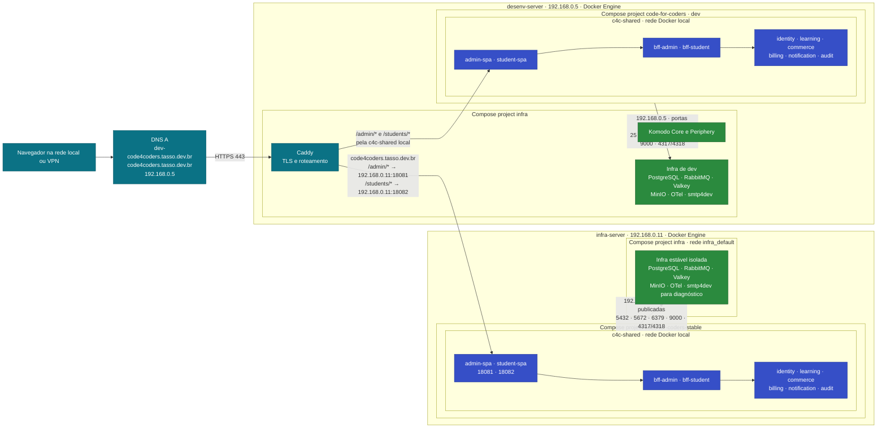

# Topologia de rede e containers

## Visão geral

## Como o tráfego passa

- Os dois registros DNS A apontam atualmente para `192.168.0.5`, endereço privado do `desenv-server`.
- O Caddy termina TLS e atende os dois domínios. A raiz redireciona para `/admin/`; as rotas sem barra final recebem redirecionamento para a versão com barra.
- No domínio `dev-code4coders.tasso.dev.br`, o Caddy acessa as SPAs diretamente pela rede Docker `c4c-shared` do `desenv-server`.
- No domínio `code4coders.tasso.dev.br`, o Caddy encaminha `/admin/*` e `/students/*` pelas portas `18081` e `18082` do `infra-server`.
- Cada SPA encaminha as chamadas da sua API ao BFF correspondente. BFFs e APIs ficam nas redes locais `c4c-shared`; não há publicação externa dessas portas.
- As aplicações conectam-se às dependências pelas portas publicadas no endereço do próprio host: `.5` para dev e `.11` para estável. As redes `c4c-shared` têm o mesmo nome, mas pertencem a Docker Engines diferentes e não formam uma rede entre hosts.
- PostgreSQL, RabbitMQ, Valkey e MinIO são separados por ambiente. O stack estável não usa dados nem filas do ambiente dev.
- No estável, o smtp4dev fica disponível para diagnóstico, mas não transporta e-mails da aplicação. Os serviços opcionais de mídia e do túnel Stripe também não estão iniciados enquanto as variáveis correspondentes permanecerem vazias.

## Projetos Compose

| Ambiente | Host e diretório | Projeto de aplicação | Arquivos da aplicação |
| --- | --- | --- | --- |
| Dev | `desenv-server:/home/tsgomes/code-for-coders` | `code-for-coders` | `docker-compose.komodo.apis.yml`, `docker-compose.komodo.web.yml` |
| Estável | `infra-server:/home/tsgomes/code-for-coders-stable` | `code-for-coders-stable` | Os dois arquivos Komodo, `docker-compose.remote.yml` e `docker-compose.stable.yml` |

Em ambos os hosts, o projeto `infra` é separado do projeto da aplicação. No `desenv-server`, ele também contém Caddy e Komodo; no `infra-server`, contém apenas as dependências próprias do ambiente estável.

## Alcance de rede

Como os registros DNS publicados apontam para um IP privado, o desenho descreve o acesso pela rede local ou VPN. O acesso pela internet pública depende de rota de entrada/NAT e DNS público apropriado; ele não foi confirmado nesta implantação.

Para atualizar os containers a partir do working tree local, consulte [scripts/update-containers.sh](../scripts/update-containers.sh) e a seção de atualização no [guia do ambiente estável](stable/README.md).
